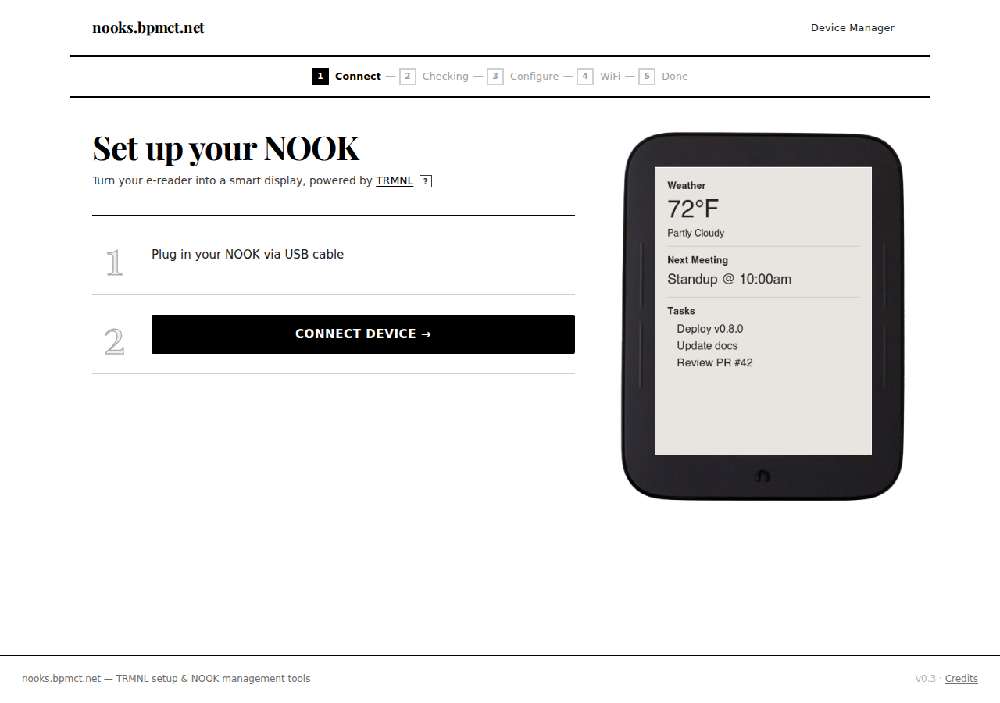

# TRMNL client for Nook Simple Touch

A [TRMNL client](https://trmnl.com/developers) for the Nook Simple Touch (BNRV300) and Nook Simple Touch with Glowlight (BNRV350). These devices usually go for around $30 on eBay and have an 800x600 e-ink display.

<table>
<tr>
<td width="33%" align="center"> <em>Configuration screen</em></td>
<td width="33%" align="center"> <em>Fullscreen view</em></td>
<td width="33%" align="center"> <em>Menu dialog</em></td>
</tr>
</table>

Questions or feedback? Please [open an issue](https://github.com/bpmct/trmnl-nook-simple-touch/issues/new).

## Table of Contents

- [Prerequisites](#prerequisites)
- [Install](#install)
  - [Easy Setup](#easy-setup-recommended)
  - [Manual Setup](#manual-setup)
- [Device Settings](#device-settings)
- [Features](#features)
- [Deep Sleep Mode](#deep-sleep-mode)
- [Aggressive Sleep](#aggressive-sleep)
- [Frames and Cases](#frames-and-cases)
- [Gift Mode](#gift-mode)
- [Roadmap](#roadmap)
- [Other Nook Models](#other-nook-models)
- [Development](#development)
- [Disclaimer](#disclaimer)

## Prerequisites
- Root the device using the [Phoenix Project](https://xdaforums.com/t/nst-g-the-phoenix-project.4673934/). I used "phase 4" (the minimal rooted install for customization). The phases were confusing because you do not need phase 1/2/3 (each is a separate backup).
- Buy a [TRMNL BYOD license](https://shop.usetrmnl.com/collections/frontpage/products/byod) and grab your SSID + API key from Developer Settings after login (or use your own server).

## Install

### Easy Setup (recommended)

The [web tool](https://nooks.bpmct.net/manage/) is a browser-based setup wizard that installs the app and configures your NOOK over USB — no ADB installation required.

> **Requires Chrome or Edge.** WebUSB is not supported in Firefox or Safari.

> **Prerequisites:** Your NOOK must be rooted first — see [Prerequisites](#prerequisites) above. Rooting via the [Phoenix Project](https://xdaforums.com/t/nst-g-the-phoenix-project.4673934/) (phase 4) and [ClockworkMod recovery](https://xdaforums.com/t/nst-g-the-phoenix-project.4673934/) is required before the web tool can connect.

The wizard walks you through five steps:

1. **Connect** — Plug in your NOOK via USB and click "Connect Device" to authorize it in the browser
2. **Checking** — Automatically checks the app version and device settings, offering to install or update as needed
3. **Configure** — Enter your TRMNL MAC address and API key (or self-hosted server URL)
4. **WiFi** — Scan for and connect to a WiFi network
5. **Done** — Your NOOK is ready

The web tool configures all required device settings automatically, including those listed in [Device Settings](#device-settings) below.

---

### Manual Setup

1. Download the APK from [GitHub Releases](https://github.com/bpmct/trmnl-nook-simple-touch/releases).
2. Connect the Nook Simple Touch over USB and copy the APK over.
3. Open the included `ES File Explorer` app.
4. In ES File Explorer: `Favorites -> "/" -> "media" -> "My Files".`
5. Tap the APK and install.
6. Connect your device to WiFi.
7. Open the app and configure the device info.

After installing manually, you'll also need to configure [Device Settings](#device-settings).

## Device Settings

In the TRMNL Device settings, set the device type to "Nook Simple Touch" as the TRMNL team was nice enough to add support for this device!

The app and the [web tool](https://nooks.bpmct.net/manage/) both configure several Android system settings for the best experience. These are applied automatically by the setup wizard, but if you're setting up manually, here's what they do:

| Setting | Value | Purpose |
|---------|-------|---------|
| Screensaver directory | `/media/screensavers/TRMNL` | Points the NOOK's native screensaver at the TRMNL image |
| Screen timeout | 2 minutes | Required for deep sleep / screensaver to activate reliably |
| Hide screensaver banner | Enabled | Hides the text overlay on the screensaver (NMM mod) |
| Disable drag to unlock | Enabled | Skips the drag-to-unlock gesture on screensaver wake (NMM mod) |
| Sleep between updates | Enabled | Enables deep sleep between refresh cycles |
| Aggressive sleep | Enabled | Sleeps immediately after each refresh rather than waiting for timeout |
| **Home button (short press)** | Launches TRMNL app | *(Optional)* Remaps the physical Home button to open TRMNL directly |
| **Home button (long press)** | Opens App Drawer | *(Optional)* Remaps long-press Home to the app drawer |

> **Note:** The Home button short press and long press remapping require [Nook Mod Manager (NMM)](https://xdaforums.com/t/nst-g-the-phoenix-project.4673934/) to be installed (included in Phoenix Project phase 4). These are optional — the app works without them. If NMM is not installed, these settings have no effect.

## Features

- On-device config UI for device ID, API key, and API URL (BYOS)
- Fetches your screen and shows it fullscreen, bypassing the lock screen until you exit
- Respects playlist intervals to advance to the next screen
- TLS v1.2 via BouncyCastle (not included in Android 2.1)
- BYOD support for TRMNL and custom server URLs
- Reports battery voltage and Wi-Fi signal strength
- Deep sleep mode for 30+ day battery life
- Aggressive sleep for maximum battery savings (benchmarking TBD)
- Gift Mode for pre-configuring devices as gifts

## Deep Sleep Mode

Without deep sleep, expect ~60 hours of battery life. With deep sleep and a 30-minute refresh rate, battery lasts 30+ days. The app writes each image to the Nook's screensaver, turns off WiFi, and sets an RTC alarm to wake for the next refresh.

To enable:
1. In the app: Enable "Sleep between updates"
2. In `Nook Settings → Display → Screensaver`: Set to "TRMNL" with 2-minute timeout
3. In `Apps → Nook Touch Mod`: Enable "Hide Screensaver Banner"

## Aggressive Sleep

Aggressive sleep is an optional mode on top of deep sleep that puts the device to sleep immediately after each scheduled image refresh, rather than waiting for the screensaver timeout. This can further improve battery life, though benchmarking is still in progress — exact savings are TBD.

To enable:
1. First enable "Sleep between updates" (see [Deep Sleep Mode](#deep-sleep-mode))
2. In the app: Settings → General → Enable "Aggressive sleep"

You can also trigger a manual sleep at any time from Settings → System → "Sleep".

## Frames and Cases

The Nook Simple Touch often develops sticky residue on its rubberized surfaces as it ages. [iFixit](https://www.ifixit.com/Device/Nook_BNRV300) has great teardown and repair guides if you need to clean or refurbish your device.

For a custom frame, I recommend this [3D-printed case on Thingiverse](https://www.thingiverse.com/thing:7140441). It requires:
- M3x4 flush screws
- M3x5x4 threaded inserts (soldering iron required to install)
- The original screws and inserts from the Nook Simple Touch

## Gift Mode

Gift Mode displays setup instructions instead of fetching content—perfect for giving a pre-configured device as a gift.

To set up:
1. Buy a [BYOD license](https://shop.usetrmnl.com/products/byod) for the recipient
2. Get the friendly device code from [trmnl.com/claim-a-device](https://trmnl.com/claim-a-device)
3. In the app: Settings → Enable "Gift mode" → "Configure Gift Mode"
4. Enter your name, recipient's name, and the device code

## Roadmap

See [GitHub Issues](https://github.com/bpmct/trmnl-nook-simple-touch/issues) for the roadmap and to submit feature requests.

## Development
See the CI workflow for build details ([`build-apk.yml`](https://github.com/bpmct/trmnl-nook-simple-touch/blob/main/.github/workflows/build-apk.yml)), and the `tools/` adb scripts for build/install workflows. A development guide is coming (https://github.com/bpmct/trmnl-nook-simple-touch/issues/8). In the meantime, the project can be built with surprisingly minimal, self-contained dependencies.

## Other Nook Models

This repository targets legacy Nook devices running Android 2.1 (API 7), which requires different tooling and approaches than modern Android. For newer Nook devices like the Nook Glowlight 4, see [trmnl-nook](https://github.com/usetrmnl/trmnl-nook).

If you have another Nook model from this era that you'd like to test, please [open an issue](https://github.com/bpmct/trmnl-nook-simple-touch/issues/new)!

## Disclaimer
AI was used to help code this repo. I have a software development background, but did not want to relearn old Java and the Android 2.1 ecosystem. Despite best-effort scanning and review, the device and/or this software may contain vulnerabilities. Use at your own risk, and if you want to be safer, run it on a guest network.
